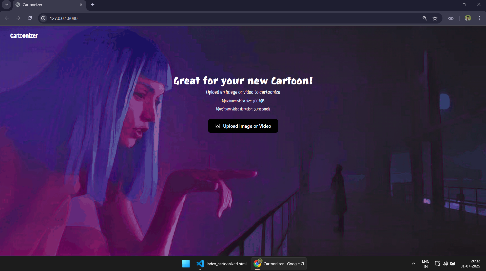
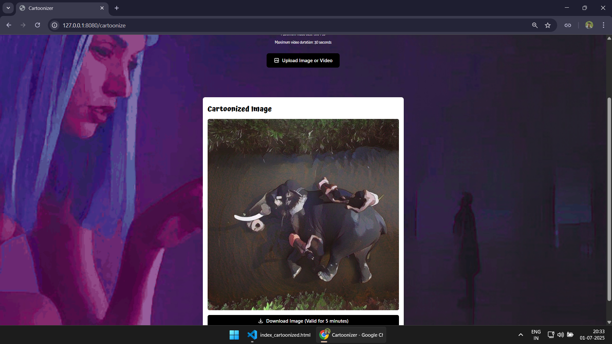

# Cartoonizer

## Abstract

Cartoonizer is a Flask-based web application that transforms uploaded media into a stylized cartoon look using a TensorFlow implementation of the White-box Cartoonization model. The project supports still images, animated GIFs, and short videos, handling preprocessing with Pillow and OpenCV before running inference and serving the result back through a simple browser UI. In practice, it works as a local-first demo for neural media stylization, with optional GPU acceleration and a partial cloud-storage path already scaffolded in the code.

## Preview

### Input


### Output


## What The Project Does

- Accepts uploads from a web page built with Flask and a single HTML template.
- Cartoonizes static images such as `png`, `jpg`, `jpeg`, and `heic`.
- Cartoonizes animated GIFs by processing frames and rebuilding the animation.
- Cartoonizes videos such as `mp4`, `avi`, and `mov`, then exports a browser-friendly MP4 when possible.
- Saves outputs locally by default and returns them for preview and download.

## How It Works

1. The Flask app in `app.py` receives a user upload and saves it into a local `static/` folder.
2. `WB_Cartoonize` in `white_box_cartoonizer/cartoonize.py` loads the pretrained model from `white_box_cartoonizer/saved_models/`.
3. Images are resized, normalized, and sent through the cartoonization network.
4. GIFs and videos are processed frame by frame before being written back to disk.
5. The result is rendered in `templates/index_cartoonized.html` for preview and download.

## Tech Stack

- Python 3.9
- Flask
- TensorFlow 2.10 using `tf.compat.v1`
- OpenCV
- Pillow
- NumPy
- Tailwind CSS via CDN

## Project Structure

```text
Cartoonizer/
|-- app.py                           # Flask entry point and upload flow
|-- config.yaml                      # Runtime flags such as local mode and GPU toggle
|-- requirements.txt                 # Python dependencies
|-- templates/
|   `-- index_cartoonized.html       # Upload and results page
|-- static/
|   |-- uploaded_images/             # Temporary image uploads
|   |-- uploaded_videos/             # Temporary video uploads
|   `-- cartoonized_outputs/         # Generated outputs
|-- white_box_cartoonizer/
|   |-- cartoonize.py                # Inference wrapper for images, GIFs, and videos
|   |-- network.py                   # Model architecture
|   |-- guided_filter.py             # Guided filtering utilities
|   `-- saved_models/                # Pretrained model checkpoints
`-- video_api.py                     # Older Algorithmia integration, separate from Flask flow
```

## Local Setup

The codebase is currently best aligned with Python 3.9 and the pinned TensorFlow stack in `requirements.txt`.

```powershell
py -3.9 -m venv .venv
.\.venv\Scripts\Activate.ps1
pip install -r requirements.txt
pip install pillow-heif
python app.py
```

Then open `http://localhost:8080` in your browser. The app also tries to print a local network URL and generate a QR code when it starts.

## Configuration Notes

The main runtime flags live in `config.yaml`.

- `run_local: true` keeps processing and file serving on the local machine.
- `gpu: true` tells TensorFlow to use a detected GPU.

Important notes:

- The current repository is set up for local use first. If you switch `run_local` to `false`, `app.py` expects Google Cloud helper code and credentials that are not included in this repository snapshot.
- Some video-related keys in `config.yaml` appear to come from an older pipeline and are not fully used by the current Flask route.

## Usage Notes

- The UI is designed around image, GIF, and short video uploads.
- Video processing is noticeably slower than image processing because frames must be transformed one by one.
- The page text mentions uploads up to about 100 MB and 60 seconds; treat that as the intended operating range for the current app.
- HEIC support depends on `pillow-heif`, which is why it is installed separately above.

## Credits

- White-box Cartoonization model adapted from the original work by SystemErrorWang.
- TensorFlow 2 compatibility notes in the source reference adaptations from `steubk/White-box-Cartoonization`.
- Repository authored by `@sangeethsanthosh-git`.
